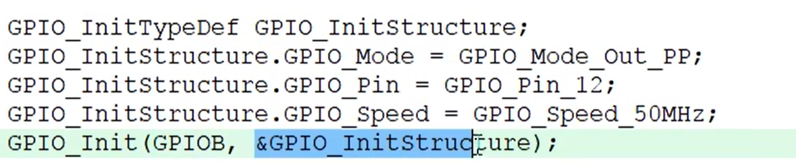
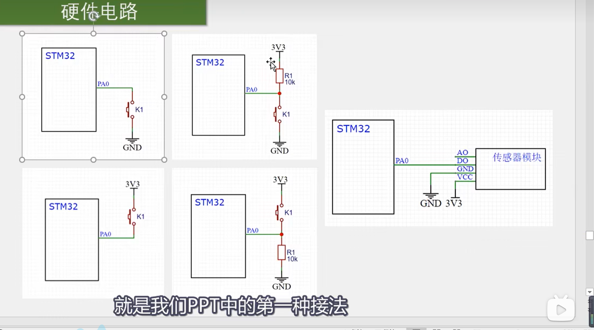
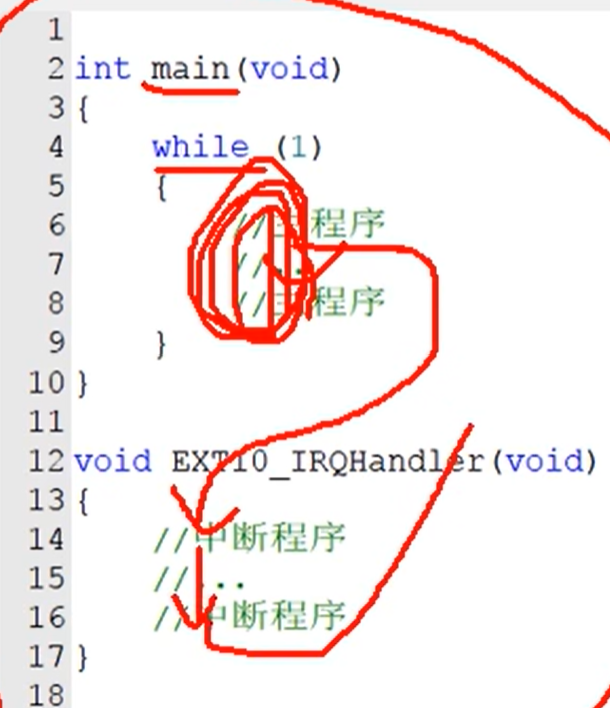

# 三轮考核

## c语言

### 1.结构体

含义：数据打包，不同类型的变量的集合，比数组的适用范围更广。

我们定义一个结构体的名字，然后配置结构体里面的参数，然后再寻结构体的内存地址来引用结构体

### 2.宏定义

宏定义是一种预处理指令，用于在编译之前替换代码中的特定文本

前面的为新名字，后面的为老名字

### 3.typrdef

作用与宏定义类似

前面的为老名字，后面的为新名字

### 4.枚举

关键字：enum

定义一个取值受到限制的整形变量，用于限制变量的取值范围。

### 4.局部变量和全局变量

### 全局变量：定义在函数外面

### 局部变量：定义在函数里面，只能在定义这个变量的函数里面使用

### 注意：如果局部变量和全局变量的名字一样，则在函数里面优先使用局部变量。

## 单片机(基于STM32F1的库函数版本)

### 单片机编写习惯

uint8_t是char，是八位无符号整数。u8就是uint8_t的简写   需我们重新用typedef定义一下
typedef int8_t s8      都表示8位有符号整数

因为这样比较简写

### 输入模式

#### Key按键

##### 思路：（最简）（猜测）

我们按下按键电路接通，外界的高（低）电平输入到GPIO口，然后GPIO口（初始值为低（高）电平）读取了这个电平变化，我们就可以设一个函数——变一次输出一个数change。我们定义一个if如果change是那个数则变化led的电平，这样就做到了一个按键控制led灯开关。

##### 按键接法

常用第一种下接方式
如图：（习惯使然）

#### 中断

##### 中断的函数模式示意

while里面是主函数的运行，然后当中断信号（比如GPIO电平的改变等等）来了，计算机自动跳转到中断函数里面执行中断，执行完之后返回主函数继续运行

##### 中断：

在主程序运行过程中，出现了特定的中断触发条件（中断源），使CPU暂停当前正在运行的程序，转而去处理中断程序，处理完成后，又返回原来被暂停的位置，继续运行。

##### 中断优先级

当多个中断源同时申请中断时，CPU会根据中断源的权重，进行裁决，优先级响应的更加紧急的中断源。

##### 中断嵌套

当一个中断程序正在运行时，又有新的更高优先级的中断源申请中断，CPU再次暂停当前的中断程序，转而去处理新的中断程序，处理后依次返回。

##### 中断性质

1. 有若干个可屏蔽的终端通道
2. 使用NVIC统一管理中断。每个中断通道都有16个可编程的优先等级，可对优先级进行分组，进一步设置抢占优先级和响应优先级。

##### NVIC

###### 全名：

嵌套中断向量控制器

###### 作用：

分配优先级，将最紧急的中断传递给CPU（相当于管家）（CPU是主人）

###### 抢占优先级：

可发生中断嵌套，无论CPU在干啥都得停下此时的工作，去处理这个中断

###### 响应优先级：

CPU在完成当前的一个工作后再来处理这个中断

###### 子优先级

定义：

子优先级在同一抢占优先级下的多个中断之间进行排序。如果多个中断具有相同的抢占优先级，那么子优先级决定了这些中断的执行顺序。

作用：

用于在同一抢占优先级下决定中断的执行顺序。高子优先级的中断会先于低子优先级的中断执行。

###### NVIC优先级分组

由四位（0-15）决定（值越小，优先级越高）

##### 外部中断（EXTI）

###### 原理：

可检测指定的GPIO口的电平信号当其指定的GPIO口发生电平变化时，EXTI马上向NVIC发出中断申请，经NVIC考虑后即可中断CPU主程序，使CPU开始执行EXTI

###### 支持的触发方式

上升沿：（电平）低到高

下降沿：高到低

双边沿：上下都可

软件出发：引脚无变化，程序执行代码时就能触发

###### 支持的GPIO口

所有的GPIO口都可，但Pin脚不能相同。

###### 通道数

16个Pin口 外加PVD RTC USB 以太网

触发响应方式

中断响应：GPIO触发中断

事件触发：触发别的外设操作

###### 映射

GPIOx->EXTI

###### 外部中断步骤 

- [ ] 使能SYSCFG时钟
   RCC_APB2PeriphClockCmd
- [ ] 初始IO口为输入
   GPIO_Init
- [ ] 设置IO口与中断线的映射关系
   SYSCFG_EXTILineConfig
- [ ] 初始化线上中断，设置触发条件等
   EXTI_Init
- [ ] 配置中断分组（NVIC），并使能中断
   NVIC_Init
- [ ] 编写中断服务函数
   EXTIx_IRQHandler
- [ ] 清除中断服务标志位
   EXTI_ClearITPendingBit
- [ ] 主函数中需要设置系统中断优先级分组
   NVIC_PriorityGroupConfig （0~4）
   4就是全部都为抢占优先级共16个
   3就是八个抢占优先级，两个子优先级
   以此内推

##### 优先级

###### 一、抢占优先级与相应优先级

1、抢占先级级和中断响应优先级配置的数字越小，其优先级越高。 高优先级的抢占优先级是可以打断正在进行的低抢占优先级中断的。

2、抢占优先级相同的中断，高响应优先级不可以打断低响应优先级的中断。

3、抢占优先级相同的中断，当两个中断同时发生的情况下，哪个响应优先级高，哪个先执行。

4、如果两个中断的抢占优先级和响应优先级都是一样的话，则看哪个中断先发生就先执行；

###### 如

系统中配置了3个中断：
中断A  配置为：抢占优先级为2，响应优先级为3

中断B  配置为：抢占优先级为2，响应优先级为2

中断C  配置为：抢占优先级为1，响应优先级为3

则 中断先级别为：C > B > A；

C 可以打断正在执行的 B 和 C。

如果A正在执行，B不可以打断A的执行，需要等待A执行完成后方可再执行。

如果A和B同时响应，则B优先响应。

### 时针系统

#### 五个时钟来源：

LSI,LSE,HSI,HSE,PLLCLK

#### 时钟源简介

RTC：实时时钟（一般选LSE）用于日志记录

- LSI：低速的内部时钟 32KHz
  内部RCC产生
  不稳定，精度不高
  作用：LSI->独立看门狗->对精度要求不高->便宜
  	   LSI->RTC

- LSE：低速的外部时钟
  外接32.768KHz的晶振产生
  作用：RTC

- HSI：高速的内部时钟
  内部 16 MHz RC 振荡器产生
  作用：系统时钟，用作输入PLL，输出

- HSE：高速的外部时钟

  外接晶振产生 （4~26MHz）正点原子的f4是8MHz
  作用：HSE->分频器2~31->RTC

- PLLCLK：锁相环时钟（分主PLL和专用PLL-----后面细嗦）
  来源：HSI HSE通过选择器选其一---->（/M）的分频器->主PLL
                                                                                             ->专用PLL

  - 主PLL：*N/P ->PLL作为系统时钟
    	      *N/Q ->PLL48CLK时钟作为USB OTG时钟
  - 专用PLL：*N/R->PLLI2SCLK时钟->I2S时钟->精度高->用于高音质高音量

#### 时钟输出功能 (MCO 输出时钟频率最大不超过 100MHz)

##### MCO1：

可输出HSI,LSE,HSE,PLL

##### MCO2：

可输出HSE,PLL,SYSCLK,PLLI2S

#### SYSCLK时钟

**最高168MHz**

##### 用途：

->以太网，PTP时钟
->AHB分频器->HCLK……AHB总线……
			->/8->Cortex系统定时器
			->FCLK Cortx自由运行时钟
			->APB分频器->APB外设时钟
					      ->APB定时器时钟

#### 常用的RCC寄存器

CR,PLLCFGR,CFGR,AHB1~3   ,APB1~2

##### 简析：

CR：时钟源的使能，等待时钟就绪

PLLCFGR：配置分频器的值

CFGR：设置AHB，APB及选择哪一个（在有多个选择时）及分频系数的配置

### 电子元件简介

#### 光敏电阻传感器模块（四线制）

##### DO口：

亮度低于阈值->高电平，反之亦然

##### 中间那个蓝色的东西：

可以调节阈值高低

