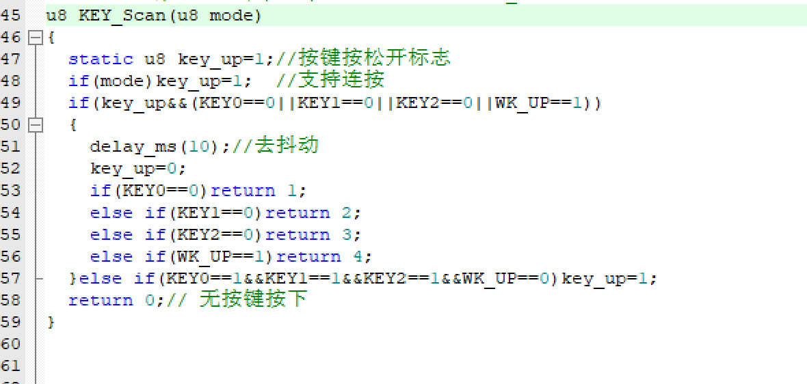

# 问题

- 为什么相同的Pin不可以同时中断，假设我们是因为AFIO引脚选择器才导致相同的Pin无法同时触发中断。
  因为AFIO是在若干组GPIO里面选择一组GPIO的16个IO口进行中断，那岂不是PA1和PB2也不可以同时进行中断了？那网课中为什么只说的相同的Pin不可以同时进行中断？（我觉得根据AFIO的原理，不同组的IO口就不能同时进行中断）

  呃呃，答：这个AFIO的工作原理居然是以Pin为单位的，AFIO把PA0,PB0,PC0,PD0,.......,PG0分为一组，然后选择其中一个口输出。（问题又来了：为什么江协在前面那个图片又是以组为单位呢？）

  那么问题又又来了，从PA-PG就七个，无法与16这个数字符合，这是为什么？
  
- 在c模块里面用一个新的定义时，我们必须考虑其头文件是否引用。

- 我们在编写程序时，可以把一些东西模块化，这样就可以使主函数更加简洁易懂
  比如我们就可以把led电平反转的相关函数写到一个函数Led_Turn里面，然后在主函数里面引用这个函数就可以了

- 

在f4版本中的外部中断实验，在key.c中我们定义了这样一个函数，但是我没发现这个在哪引用了。实际上这里面的参数就直接被exti.c里面的用了，不应该先引用这个函数再搞其他的吗？

- 我们的外部中断不是用GPIO的中断响应吗？就是发生电平变化就可以引起外部中断了吧
  答：是这样子的，注意 每个初始化或者干啥之前要定义结构体的定义结构体，要使能的就使能，千万懒不得！！！！！！！！！
- F1版本的AFIO_BASE和F4版本的SYSCFG_BASE一样
- 不管我们在设置了中断的io口那设不设置按键，只要电平变了，我们就可以出现中断（中断控制）
  因为中断的作用是显示错误，或一个瞬间的现象
  拿按键的例子来说：我们是因为要去检测按键是否按下才设置的中断（引起LED闪烁或者蜂鸣器叫之类的）（因为中断只是做一个判断所以不能在中断中停留太久）（瞬时性）
- 我们在消抖之后还要判断一下电平的变化，因为消抖在中断服务函数里面，所以当我们按下按键的时候，电平下降，触发中断，但是按键抖动可能又来一次从高到低的电平变化，故我们需要在终端服务函数里面再判断一次，才能执行能表明中断产生的现象代码
- 